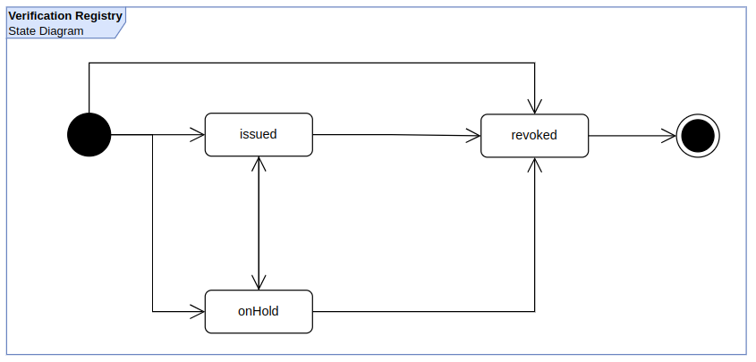

# Verification Registry

Verification Registry Smart contract is an optimized implentation focused on concurent revocation of any kind of data expresed as a simple unique identifier (e.g. cryptographic digest).

## Terminology

- digest: The output of applying a hash function to any kind of data.
- issue: In this context, the process of registering a digest cryptographically endorsed by an entity interacting with this contract.
- entity: The one interacting with this contract to perform some action.

## Base Considerations

- Permissionless: This contracts is open to anyone, which means ayone can write and read this contract.
- All actions performed in this contract all relative to the entity "sealing" some digest. There are four basic features in this implementation:

  - Issuance: The process by which an entity endorses a digest. For example an entity(entity "B") can add its "seal" to a digest which means that relative to "B" such digest was attested by entity "B" for some time.
  - Revocation: An entity can revoke a digest. So it must be understood that such entity is revoking it seal to the information behind that digest. An important point to consider here is that revocation is relative since an entity "A" can revoke a digest without meaning that such digest is universally revoked, instead it just means that such entity (entity "A") is removing its "seal" to that digest. A digest can be revoked directly without previously having been issued.
  - update: A digest can only be updated if it was previously issued. The update can only be applied in regards to the expiration date.
  - On Hold: Under some circumstances, the entity may want to put "on hold" a digest for some time. It may be useful for cases where the underlying data digest is being analyzed or while some issue is being resolved. Either way, when a digest is "on hold" it should not be considered valid. The resolution of "on hold" state, in the context of an issuer, may lead to move that digest to the "issued" or "revoked" state (revoked is an irreversible permanent state).

- Inside organizations there may be the case where other organizations (dependencies/sub departments or just other organizations) need to endorse a digest on behalf of the organization. Taking this into account, this contract integrates with [lacchain identity contracts](https://github.com/lacchain/LACChain-identity-contracts) to leverage the concept of "delegates" in such a way that these other organizations can execute actions which are finally made as if those actions were made by the main organization.

## State Diagram

The following diagram shows all the possible state transitions between `issued`, `onHold`, and `revoked` states.

## Smart Contract Considerations

- Even when in this documentation it is mentioned the term "digest" to express a unique identifier for some data; in reality the unique identifier may be any kind of identifier that can be expressed as a bytes32 representation.
- When issuing a digest it is also important to consider the need of sending many operations at the same time. This contract uses EIP712 to encapsulate the sender in such a way that the concept of "msg.sender" is decoupled from the "entity" performing an operation in this contract. The benefit of doing this is that an entity can kind of "send" many transactions in the same block.
  - This feature was implemented for the most demanding methods which are "issue" and "revoke".
- On contract deplyment it is required to pass the defaultDelegateType like ["veriKey"](https://github.com/lacchain/LACChain-identity-contracts/blob/master/DidSpecs.md#verikey-delegate-type); this variable represents a bytes32 representation of a delegate type according to [ERC1056](https://github.com/ethereum/EIPs/issues/1056) based contract implementations like [lac1 underlying did registry](https://github.com/lacchain/LACChain-identity-contracts/blob/master/contracts/identity/didRegistry/DIDRegistry.sol) Additionally, any entity desiring to use a custom delegate type other than defaultDelegateType can do it by setting that custom delegate type for such member.
- At any time, an entity is able to point to a different [didRegistry](https://github.com/lacchain/LACChain-identity-contracts/blob/master/contracts/identity/didRegistry/DIDRegistry.sol) instance. This gives the flexibility to:
  - Point to a modified implementation of the didRegistry which still follows the same [didRegistry interface](../../contracts/identity/IDIDRegistry.sol). Consider this option carefully, since your delegates (if needed) must be set at that contract instance, otherwise didRegistry validations would fail.

## Smart contracts

- [Generic Verification Registry](../../contracts/verification-registry/generic/VerificationRegistry.sol)

- [Verification Registry with Gas Model for LACChain Networks](../../contracts/verification-registry/gasModel/VerificationRegistry.sol)

## Smart contracts Methods and Emmitted events (Contract Interface)

- [Verification Registry Interface](../../contracts/verification-registry/IVerificationRegistry.sol)
